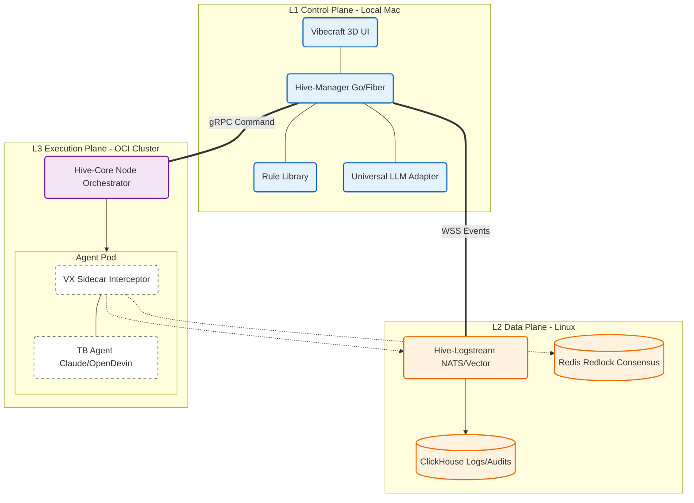

# HiveOS: 工业级分布式 AI 代理指挥系统 - 技术工程规范 (Final Spec)

> [!IMPORTANT]
> 本文件为 HiveOS 的最终架构蓝图。系统设计遵循 “本地决策、远程执行、全局共识、透明监控” 的商业闭环逻辑，旨在建立一个具备自进化与自净化能力的 AI 复数代理协同环境。

## 1. 系统架构拓扑 (Physical & Logical Topology)

HiveOS 采用 **控制平面 (Control Plane)** 与 **数据平面 (Data Plane)** 物理分离的架构，确保管理端的交互体验与执行端的高性能运行互不干扰。

### 1.1 物理部署模型

### 1.2 核心生命周期
1.  **策略加载**: 管理端向执行端下发任务包及规则模板 (`claude.md`)。
2.  **原子化拉起**: 执行端校验资源并启动容器，Sidecar 强校验规则注入。
3.  **协同执行**: 各 Agent 基于“任务共识”认领子项，通过 NATS 实时同步协作记忆。
4.  **全链路审计**: 执行行为实时回传至 ClickHouse 并同步到 3D 监控 UI。

### 1.3 通用模型适配网关 (Universal Hive-LLM-Adapter) [UPGRADE]
为了确保极致的泛用性，网关层不再绑定特定厂商，而是采用标准化的适配架构：

*   **标准化适配 (Standardized Adapter)**: 网关原生支持 **OpenAI 协议格式**。这意味着不仅是 OpenAI，市面上几乎所有兼容 OpenAI 格式的厂商（DeepSeek, Moonshot, Groq, OpenRouter）以及本地部署的 LLM (Ollama, vLLM) 均可实现“即插即用”。
*   **多源驱动 (Multi-Source Driver)**:
    *   **原生驱动**: 针对 Anthropic/Gemini/Bedrock 提供深度优化的 SDK 驱动。
    *   **协议转接**: 对不支持标准协议的特殊 API，通过自定义中间件进行协议转换。
*   **密钥集约化与混淆 (Secrets Orchestration)**: 所有 Provider 的 Key 统一在本地 Mac 管理。网关支持 **多 Key 轮询 (Load Balancing)** 与失败自动切换，确保 Agent 执行的连续性。

---

## 2. 蜂巢协作协议与博弈模型 (Collaboration & Game Theory)

系统不仅关注分工，更通过 **“权力制衡”** 实现商业级颗粒度的执行一致性。

### 2.1 角色博弈矩阵

| 角色 | 代号 | 职责定义 | 交付物 | 核心考量 |
| :--- | :--- | :--- | :--- | :--- |
| **董事长** | **CEO** | **最高意志**。负责方向决策与终极冲突仲裁。 | 审批指令 | 系统级博弈与战略平衡 |
| **策略组** | **A/B** | (Intel) 负责创意与竞调，输出 **需求规格包 (Spec-Pack)**。 | 创意/竞品报告 | 脑洞广度、信息时效性 |
| **架构组** | **C** | (Arch) **核心大脑**。将 Spec-Pack 转化为 **任务图谱** 与 **接口契约**。 | 架构图/Interface | 架构强一致性、逻辑闭环 |
| **落地组** | **D/E** | (Labor) 代码编写与底层调试。 | 源码/测试单 | 代码吞吐量、健壮性 |
| **神卫** | **F** | (Guard) **自动化稽查者**。实时对比“实际产出”与“架构契约”，违规即拦截。 | 审计报告/拦截 | 毫秒级判定、零误报 |

### 2.2 冲突裁定回路
*   **影子仲裁 (Oracle)**: 系统内置中立 Agent，在 C/D 发生技术分歧时提供基于 Spec-Pack 的第三方评估报告。
*   **自动纠偏**: F 级稽查发现偏离架构时，通过 Hive-Core 直接封锁相关节点的写权限。
*   **UI 穿透响应**: 死锁状态（僵化）将自动在 3D UI 触发红色高亮警报，推送至董事长端（Mac）进行人工裁定。

### 2.3 权限矩阵 (Permission Matrix)

| 角色 | 文件权限 (FS) | 网络权限 (NET) | 系统指令 (CLI) | 跨 Agent 交互 |
| :--- | :--- | :--- | :--- | :--- |
| **A/B 策略** | 读/写 (调研目录) | **开启 (WebSearch)** | 受限 (仅应用层) | 允许 (上报需求) |
| **C 架构** | 读/写 (全库) | **关闭** | 开启 (分析工具) | 允许 (下发契约) |
| **D 开发** | 读/写 (Src/Web) | **关闭** | 受限 (编译/测试) | **禁止 (需通过架构)** |
| **F 神卫** | **只读 (全库)** | **关闭** | 开启 (审计工具) | **强制 (全链路拦截)** |

### 2.4 模型分配矩阵 (Universal Allocation Matrix)

| 角色 | 推荐模型等级 | 示例 Provider (可自由更换) |
| :--- | :--- | :--- |
| **CEO** | Tier-1+ (Complex Reasoning) | o1-pro, Claude 3.5 Opus |
| **C** | Tier-1 (Solid Architecture) | GPT-4o, Claude 3.5 Sonnet |
| **D** | Tier-2 (High Throughput) | DeepSeek-Coder, Llama-3-70B |
| **A/B** | Tier-3 (Cost-Efficient) | GPT-4o-mini, Moonshot-v1 |
| **F** | Tier-2 (Fast Reasoning) | Groq (Llama-3), Gemini Flash |

---

## 3. 全局共识与数据一致性 (Data Consensus)

在复数 Agent 共同构建任务时，维护清单的一致性是系统的核心命题。

1.  **分布式任务看板 (Board-SSoT)**: 建立基于强一致性存储 (**Redis Redlock + NATS JetStream**) 的全局任务机。
2.  **抢占式认领**: Agent 在开始工作前必须获得总线锁，并在看板同步状态。
3.  **依赖锁死**: 架构师 C 未完成的模块，其下游子任务在看板中处于“逻辑锁定”状态，不可被 D/E 认领。
4.  **协作记忆同步 (Collective Memory)**: Sidecar 实时捕捉节点 A 的关键状态变更（如：新定义的类名），并无感注入节点 B/C 的上下文字典中。

---

## 4. 安全严谨性与安全性隔离 (Security & Rigor)

*   **零信任架构 (Zero Trust)**: 所有本地与远程的通信均基于证书中心（CA）轮转产生的 **mTLS 双向认证**。
*   **资产隔离 (Isolation)**:
    *   **架构化权限 (RBAC)**: 根据角色分配 Linux Capability 集合，严格限制容器提权。
    *   **物理隔离域**: 划分白区 (Internet)、红区 (Core)、蓝区 (Audit)，通过 NATS 跨域安全传输。
*   **无痕注入 (Secret Guard)**: 所有的 API Key 和 `claude.md` 规则通过内存文件系统 (**tmpfs**) 挂载，容器销毁即消失，不留物理痕迹。

---

## 5. 技术栈与性能定型 (The Bedrock)

| 领域 | 组件选型 | 商业价值 |
| :--- | :--- | :--- |
| **执行核心** | **Golang 1.23+** | 极致并发，单二进制部署，最小化远程环境依赖。 |
| **消息/事件** | **NATS JetStream** | 支持“至少一次”交付与持久流快照，解决断点续传。 |
| **存储审计** | **ClickHouse** | OLAP 架构，支持海量任务日志的高吞吐写入与秒级查询。 |
| **日志采集** | **Vector (Rust)** | 极低内存开销，支持实时 PII 脱敏与 Zstd 分段压缩。 |
| **渲染引擎** | **Three.js (LOD 优化)** | 支撑百级节点下的平滑 3D 可视化，支持视锥裁剪。 |

---

## 6. 开发者备注：自洽性验证准则

本项目开发过程中，每一行代码的合并都必须通过 **“自洽性校验流程”**：

*   **逻辑自洽**: 功能实现是否符合本 Spec 定义的安全与协作模型。
*   **数据自洽**: 所有的状态变更必须产生可审计的 Trace 记录。
*   **工程自洽**: 包含完整的单元测试、错误处理（指数退避）与监控打点。
